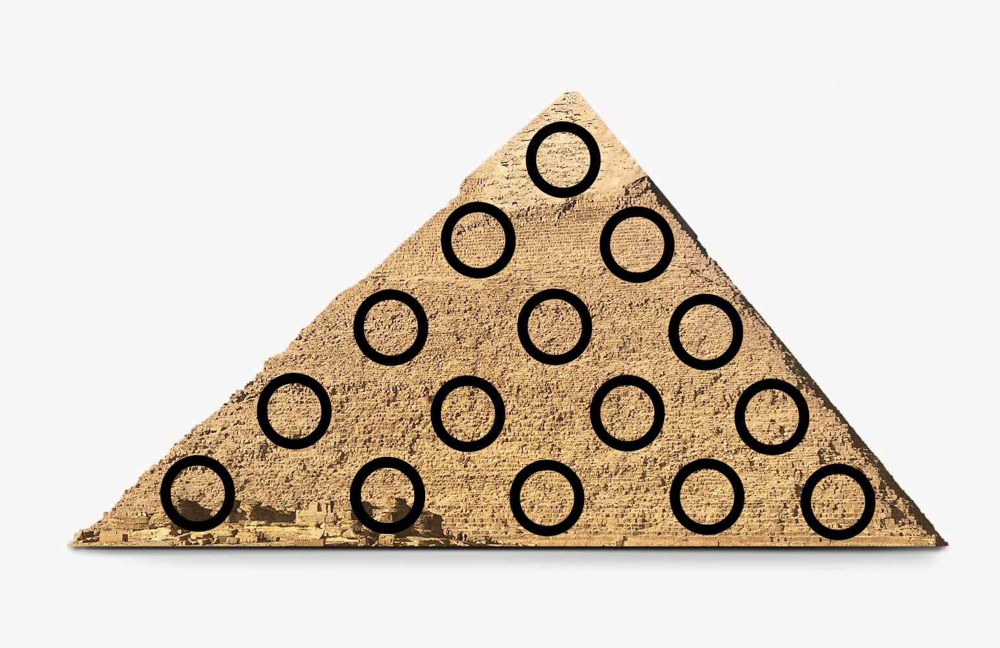
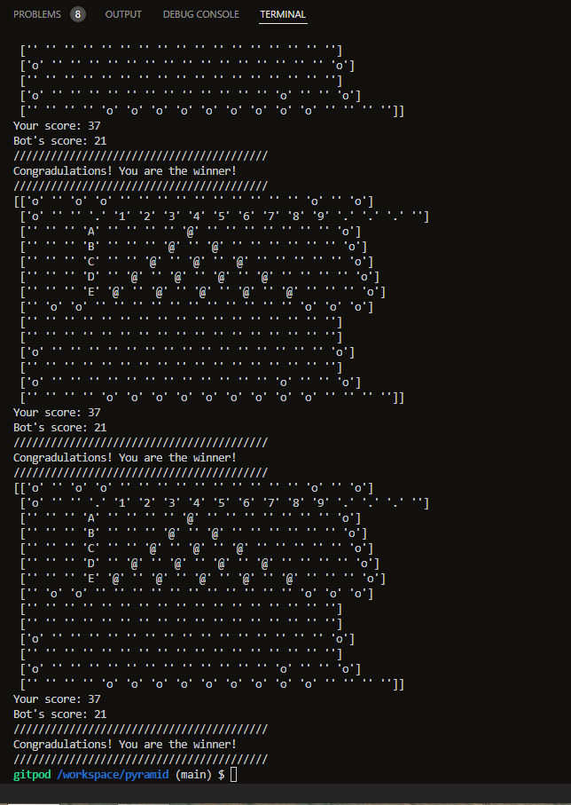
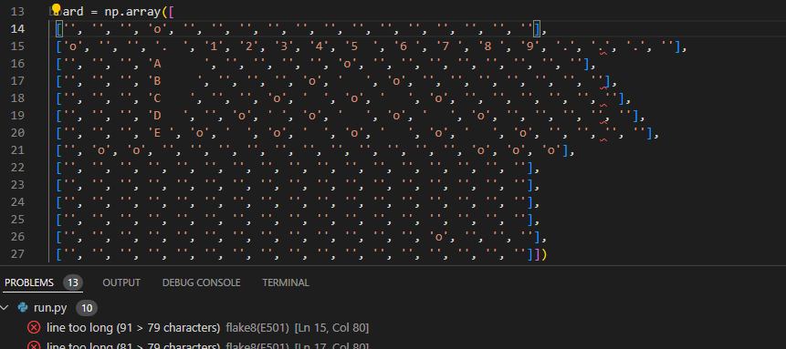
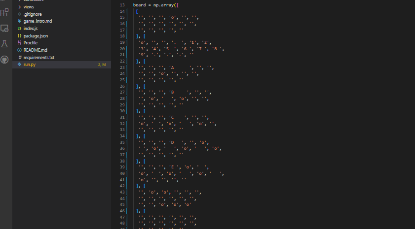

### Top 
<h1 style="text-align: center;"><strong>Pyramid Game</strong></h1>
<h2 style="text-align: center;"><strong>Welcome to the README PAGE of the Pyramid Game</strong></h2>

### Link to the Pyramid Game app:  

<a href="https://pyramid-lines.herokuapp.com/">https://pyramid-lines.herokuapp.com/</a>

### Link to the GitHub page with Pyramid Game:  

<a href="https://github.com/gretazas/pyramid">https://github.com/gretazas/pyramid</a>

# Acknowledgements

Python is a language that I haven't done any projects with yet. That is my third portfolio in Code Institute, but my very first project in Python language.
Usually, when I start a new chapter in the course, I would check what is expected in the project at the end of the course, to start thinking of ideas during the course. Think of the code I could use in the project. In the beginning, was kind of difficult to think of something, but it just came to me. I was not sure if I will be able to pull it off. And I think if it is not Numpy I wouldn't be able.  The thought of this game. It gave me pride, and joy and brought good memories. My mom, who passed away recently, taught me this game when I was small. We used to play it on copies. It would bigger pyramid though 10 points max line, not 5. And I added a rule where the player can get a score for multiple lines, where we would claim filled line as a separate move, without adding position.
My mom was a coder too,  she told me stories about the very first gigantic computers she used to work with and the algorithms she used to write. 

# **[Game Instructions/Rules](./game_intro.md)**

# Content

* [Built to practice](#built-to-practice)
* [User experience](#user-experience)
* [Buildpacks Used](#buildpacks-used)
* [Frameworks, Libraries & Programs I Used:](#frameworks-libraries-and-programs-i-used)
    * [Random](#random)
    * [Numpy](#numpy)
    * [Threading](#threading)
* [Proved By](#proved-by)
* [Features](#features)
* [Future features](#future-features)
* [Deployment](#deployment)
    * [How To Fork A Repository](#how-to-fork-a-repository)
    * [How To Clone A Repository](#how-to-clone-a-repository)
    * [How To Make A Local Clone](#how-to-make-a-local-clone)
* [Testing](#testing)
* [Code](#code)
* [Issues and bugs](#issues-and-bugs)
* [Focus group](#focus-group)
* [Contact](#contact)

# Built to practice

- Implement a given algorithm as a computer program
- Adapt and combine algorithms to solve a given problem
- Adequately use standard programming constructs: repetition, selection, functions, composition, modules, aggregated data (arrays, lists, etc.)
- Explain what a given program does
- Identify and repair coding errors in a program
- Use library software for building a graphical user interface, or command-line interface, or web application, or mathematical software
- Implement a data model, application features, and business logic to manage, query and manipulate data to meet given needs in a particular real-world domain.
- Demonstrate and document the development process through a version control system such as GitHub
- Deploy a command-line application to a cloud-based platform

# User experience

The user is welcomed with a greeting at the beginning of the game.
The user is asked to put valid input to choose the level:
- E for easy one where the user makes the first move.
    - Advantage of this situation for the user is that when the game is over user's move is the last one. That gives the user extra points.
- H for hard level.
    - Disadvantage of this situation for the user is that the Bot starts and ends the game, which gives it extra points to score.

The user has to have some tactics in the game, but can not predict the game fully, since the Bot is making random moves. 

The user is asked to put valid data to make move.
- For the position in the Row the user must choose a letter between A-E.
- For the position in the Column the user must choose a number between 1-9.
Those two coordinates become the position on the board in Pyramid Game.

The Player must guess the Bot's possible moves. And there is a window for a bit of gambling here. The Player could prepare a few lines to be completed only with one position chosen to get more points with one possible move. But it is also a risk that the Bot could choose positions randomly. But also Player could plan a bit of the position situation, hoping that the Bot would choose useful positions giving a chance for the user to fill a couple of lines with one move.

At the end user gets the informational message about the winning, losing, or the draw of the game.

# Buildpacks Used

- heroku/python
- heroku/nodejs

# Frameworks, Libraries and Programs I Used

- Random
- Numpy
- Threading

# Proved By

- <a href="http://pep8online.com/" target="_blank">PEP8: </a> no errors found

(<a href="#top">Back to top</a>)

# Features

- The first feature in this app is a printed Welcome message.
- The first interactive feature in this app is to choose a level. Easy/ Hard.
- Then the board is printed along with scores.
- Then followed by making the move using inputs only if the Player chose easy level.
     - It is easy because in this case the Player starts and ends the game.
     - It gives a chance to earn extra points.
- Or the Bot randomly chooses a position on board if a level is hard.
    - It is hard because in this case the Bot starts and ends the game.
    - Player must predict the Bot's last moves to earn a higher score.
- Printed score update.
- Printed information is maintaining with each score:
(There could be multiple line score at the same time)

    - In Rows
    - In Columns
    - In Diagonals
- Changing active players after each move.
- Print at the end of the game with announcing message stating your win/loss.

# Future features

* In the future I would like to add one more level of difficulty and add bots logic where it could see potential in scoring more points with certain position moves.
* Specify the board when conditioning if 'o' not in line, so could eliminate rows of lines in board.

(<a href="#top">Back to top</a>)

# Deployment

This project was deployed using a personal Heroku account.

Steps for deployment:
- Fork or clone this repository
- Create a new Heroku app
- Set the buildpacks to Python and NodeJS in the order
- Link the Heroku app to the repository
- Click on **Deploy**

[How to Fork a Repository:](https://support.atlassian.com/bitbucket-cloud/docs/fork-a-repository/)
1. Login or Sign Up to [GitHub](https://github.com/).
2. On GitHub, go to [https://github.com/gretazas/pyramid](https://github.com/gretazas/pyramid)
3. In the top right corner, click "Fork".

[How to Clone a Repository:](https://support.atlassian.com/bitbucket-cloud/docs/clone-a-repository/)
1. Login in to [GitHub](https://github.com/).
2. Fork the repository [https://github.com/gretazas/pyramid](https://github.com/gretazas/pyramid) using the steps above in [How To Fork a Repository](#how-to-fork-a-repository)
3. Above the file list, click "Code".
4. Choose if you want to close using HTTPS, SSH or GitHub CLI, then click the copy button to the right.
5. Open Git Bash.
6. Change the directory to where you want your clone to go.
7. Type git clone and then paste the URL you copied in step 4.
8. Press Enter to create your clone.

How to make a Local Clone:
1. Login in to [GitHub](https://github.com/)
2. Under the repository name, above the list of files, click "Code".
3. Here you can either Clone or Download the repository.
4. You should close the repository using HTTPS, clicking on the icon to copy the link.
5. Open Git Bash.
6. Change the current working directory to the new location, where you want the cloned directory to be.
7. Type git clone and then paste the URL you copied in step 4.
8. Press Enter and your local clone will be created.

The site was deployed to Github pages using the following steps:
* In the Github repository, navigate to the settings tab.
* Scroll down and select Pages from the left side navigation menu to open Github pages.
* In the Source section, click on the dropdown menu and select the Master branch.
* Once the Master branch is selected the page will refresh to display a message stating "Your site is published at 

(<a href="#top">Back to top</a>)

# Testing

I have manually tested this project by doing the following:
- Passed the code through a PEP8 linter and confirmed there are no problems.
- Given invalid inputs: strings when numbers are expected, out of bounds inputs, same input twice.
- Tested in my local terminal and the Heroku terminal.
- Checked if the map for letters turned into numbers to choose a position in the Row is converted right.
- Checked for right scores with lines in Rows.
- Checked for right scores with lines in Columns.
- Checked for right scores with lines in Diagonals.
- Tested if scored when multiple lines are filled at once.
- Made sure the User starts the game when a level is Easy.
- Made sure the Bot starts the game when a level is Hard.
- Checked each and every line is scored correctly.
- Checked if the score was implemented accordingly.

# Code

Inspiration for the project came from my mom. She taught me this game when I was small. 

* All code was written by myself and was learned from [www.codeinstitute.net](https://www.codeinstitute.net).
* As far as I know game does not exist on the internet. I like logic games but never came across this one. 
* Tutorials of battleship game and Tik Tac Toe that helped me to figure out how to build my game.
* Had to figure out how to count score. That's where np.count_nonzero() came to help.
* How to mark the line as taken not to count it again. So I decided to add more lines onto the board, that would be hidden from the user.
* The reason for that is that all game conditioning is based on: if 'o' not in a Row/ Column/ Diagonal, count points = True.
* So every time there are no 'o's left in the line computer will count the non-zero strings in the line and will add them to the score.
* Then the additional, hidden line will be marked with 'o' so it will never be counted again. (if 'o' not in a Row/ Column/ Diagonal, count points = False)
* The issue with Diagonals is that they would come across Columns. I added multiple empty lines and columns for Diagonals not to criss-cross with Columns when marked taken.
* Some rows and columns are marked with 'o' already to tell the computer not to consider those lines for the score as if no 'o's.
* Every taken move is marked '@' for the Player to see taken positions. The computer will not let repeat the move.
* At the moment Bot makes random moves generated by the computer.

# Issues and bugs

* Diagonals. Was not sure if I will be able to make it after all when it comes to diagonals. Was a great coding experience. Numpy has this incredible program that can recognize diagonals. The other issue I came across, is that my game has different types of diagonals. Those which go from the top left and those that go from the top right. But luckily Numpy is the master for both types. The difference was that it would read the line backward, but it did not make any issues to my code at this point,  as I only need to count the non-zero value characters.
* It took me a while to figure out how diagonals will work on the board in order of marking the taken lines. 
* How the score will be counted and lines will be marked as taken.
* At some point I got the last function run over 50 times and was stuck in a loop. Later I figure out that def check_for_lines() ran multiple times. I needed to make sure that the scored points are counted before announcing the message of winning/ losing/ draw. 

* Too long lines was another issue 

(<a href="#top">Back to top</a>)

# Focus Group

* I'd like to thank the following people for the help they gave me with this project:
  - My daughter Madelyne for helping me with README.md page and checking the game function. 
  - John, Alex, and Gemma from Code Institute Tutor Assistance. 
  - Help from Code Institute Slack app: 
        DaveHarricks_ci, Sean YOUng_aluminati, Ian Meigh_5p,
        Eventyret_mentor, DaveHorocks_5p, Manni_alumnus

  
  
 
# Contact 

 https://github.com/gretazas 
Greta Baliunaite: [ https://www.facebook.com/greta.baliunaite]( https://www.facebook.com/greta.baliunaite)

 
 

![Safe](https://img.shields.io/badge/Stay-Safe-red?logo=data:image/svg%2bxml;base64,PHN2ZyBpZD0iTGF5ZXJfMSIgZW5hYmxlLWJhY2tncm91bmQ9Im5ldyAwIDAgNTEwIDUxMCIgaGVpZ2h0PSI1MTIiIHZpZXdCb3g9IjAgMCA1MTAgNTEwIiB3aWR0aD0iNTEyIiB4bWxucz0iaHR0cDovL3d3dy53My5vcmcvMjAwMC9zdmciPjxnPjxnPjxwYXRoIGQ9Im0xNzQuNjEgMzAwYy0yMC41OCAwLTQwLjU2IDYuOTUtNTYuNjkgMTkuNzJsLTExMC4wOSA4NS43OTd2MTA0LjQ4M2g1My41MjlsNzYuNDcxLTY1aDEyNi44MnYtMTQ1eiIgZmlsbD0iI2ZmZGRjZSIvPjwvZz48cGF0aCBkPSJtNTAyLjE3IDI4NC43MmMwIDguOTUtMy42IDE3Ljg5LTEwLjc4IDI0LjQ2bC0xNDguNTYgMTM1LjgyaC03OC4xOHYtODVoNjguMThsMTE0LjM0LTEwMC4yMWMxMi44Mi0xMS4yMyAzMi4wNi0xMC45MiA0NC41LjczIDcgNi41NSAxMC41IDE1LjM4IDEwLjUgMjQuMnoiIGZpbGw9IiNmZmNjYmQiLz48cGF0aCBkPSJtMzMyLjgzIDM0OS42M3YxMC4zN2gtNjguMTh2LTYwaDE4LjU1YzI3LjQxIDAgNDkuNjMgMjIuMjIgNDkuNjMgNDkuNjN6IiBmaWxsPSIjZmZjY2JkIi8+PHBhdGggZD0ibTM5OS44IDc3LjN2OC4wMWMwIDIwLjY1LTguMDQgNDAuMDctMjIuNjQgNTQuNjdsLTExMi41MSAxMTIuNTF2LTIyNi42NmwzLjE4LTMuMTljMTQuNi0xNC42IDM0LjAyLTIyLjY0IDU0LjY3LTIyLjY0IDQyLjYyIDAgNzcuMyAzNC42OCA3Ny4zIDc3LjN6IiBmaWxsPSIjZDAwMDUwIi8+PHBhdGggZD0ibTI2NC42NSAyNS44M3YyMjYuNjZsLTExMi41MS0xMTIuNTFjLTE0LjYtMTQuNi0yMi42NC0zNC4wMi0yMi42NC01NC42N3YtOC4wMWMwLTQyLjYyIDM0LjY4LTc3LjMgNzcuMy03Ny4zIDIwLjY1IDAgNDAuMDYgOC4wNCA1NC42NiAyMi42NHoiIGZpbGw9IiNmZjRhNGEiLz48cGF0aCBkPSJtMjEyLjgzIDM2MC4xMnYzMGg1MS44MnYtMzB6IiBmaWxsPSIjZmZjY2JkIi8+PHBhdGggZD0ibTI2NC42NSAzNjAuMTJ2MzBoMzYuMTRsMzIuMDQtMzB6IiBmaWxsPSIjZmZiZGE5Ii8+PC9nPjwvc3ZnPg==)

(<a href="#top">Back to top</a>)

