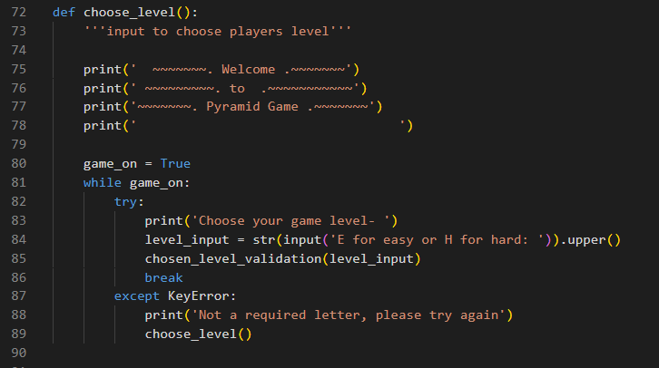
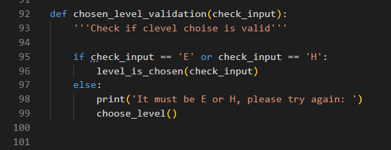
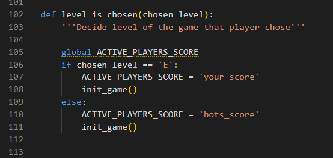
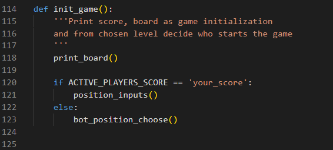
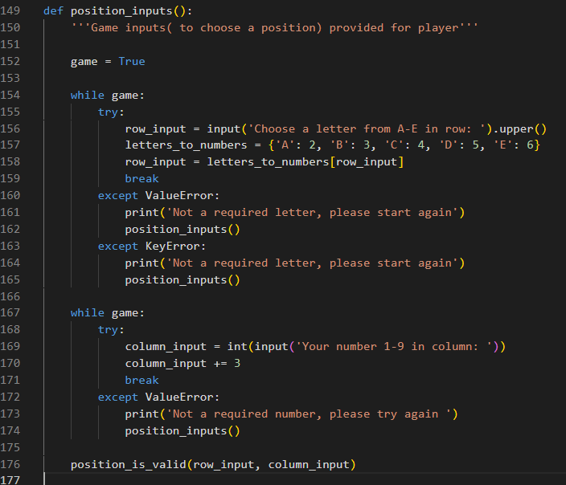
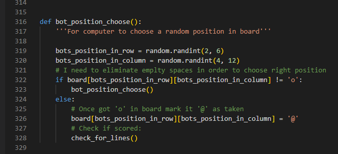
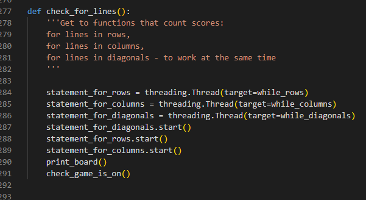

First called function is choose_level()

After we need to check if data is valid

When level is chosen, need to decide who will begin the game. 
- For E(easy) the Player starts the game 
- For H(hard) the Bot starts the game

- For E(easy) the Player starts the game and brings us to position_inputs()
- For H(hard) the Bot starts the game and brings us to bot_position_choose()

Next picture shows that the Player must choose a position in the board to make a move

The Bot chooses random position, by running positions with condition to get 'o' in it

Then we check if we got any lines to score points. 
We must run all functions together before continuing the game so we use threading

