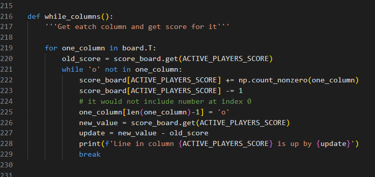

First called function is choose_level()

After we need to check if the data is valid

When the level is chosen, need to decide who will begin the game. 
- For E(easy) the Player starts the game 
- For H(hard) the Bot starts the game

- For E(easy) the Player starts the game and brings us to position_inputs()
- For H(hard) the Bot starts the game and brings us to bot_position_choose()

The next picture shows that the Player must choose a position on the board to make a move

The Bot chooses a random position, by running positions with the condition to get 'o' in it

Then we check if we got any lines to score points. 
We must run all functions together before continuing the game so I use threading.

Those functions in the function check_for_lines() are:
- def while_rows()
    Here I just run for loop to get each row filled fully with '@'s, making a line to count the score.
    Function np.count_nonzero(one_row) is very handy here to count all '@'s in the line.
- def while_columns()
    The same situation with the columns np.count_nonzero(one_column).
- def while_diagonals()
    With diagonals I found it tricky, so decided to treat each diagonal individually

The next function would be check_game_is_on() before continuing need to check if there are any empty positions, if not- announce win/loss/draw

print_board()

Change active player 

And the last function would be decide winn/loss/draw def decide_winner()

