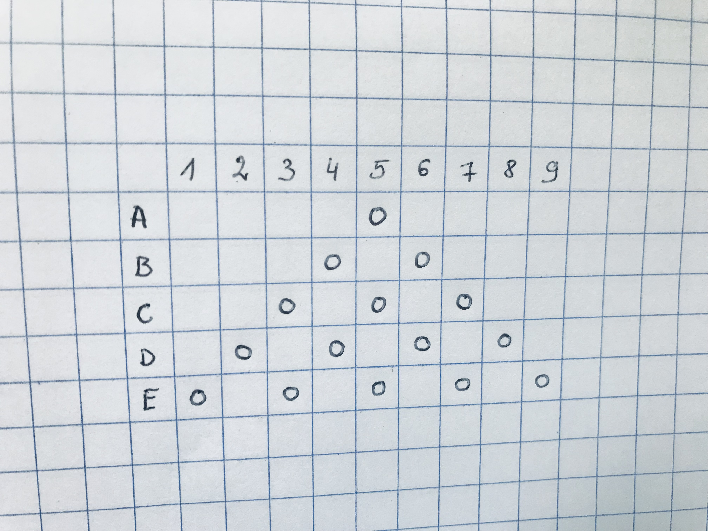
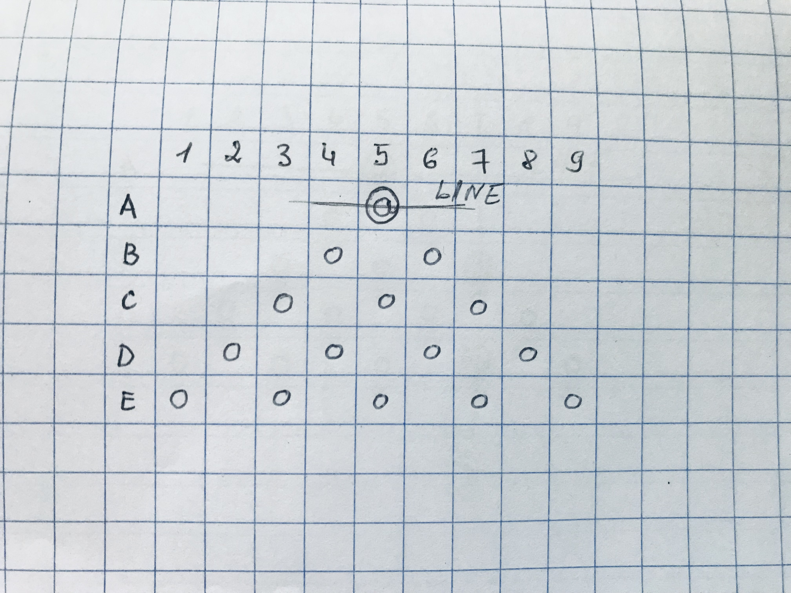
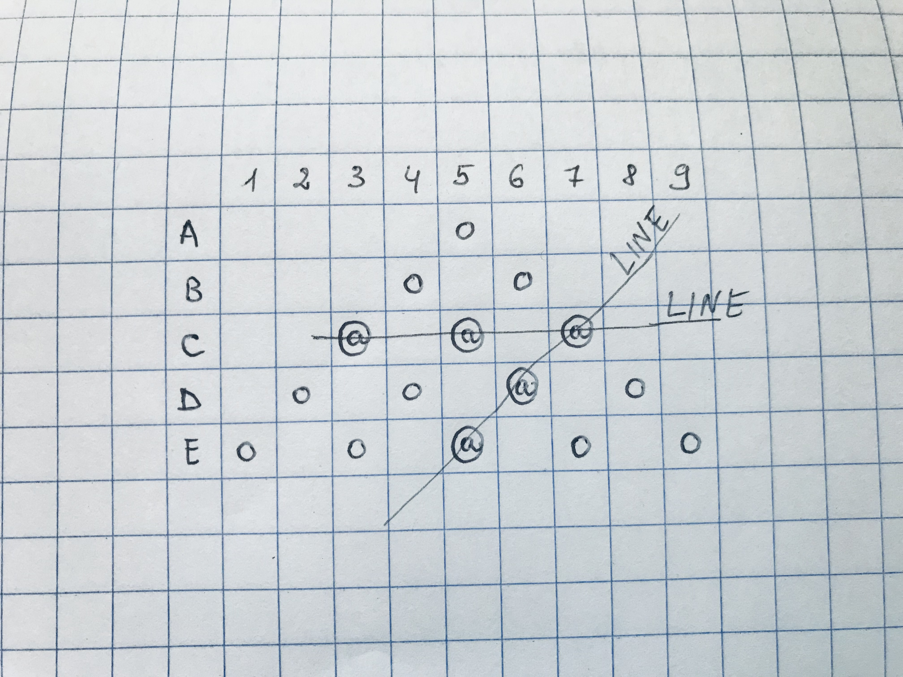

# Game introduction

[Back to README page](./README.md)

Originally game would look like in the picture at the beginning only when playing on the paper I don't need any letters or numbers. 
Those would be indicators for the user to get an idea of where to choose the position. 

In the second picture, you can see I point taken. It will be marked that the Player scored one point in the Row.  
Originally in the game, I would stroke a line there to mark it is taken.

In the third picture, you can see two lines taken. 
Each line would score 3 points. 
If the last move ther was C7, the Player gets 6 points in total for one move.

In the last picture, you can see all possible lines scored throughout the game.  
There you can peek behind the scene too. You can see all the hidden board where functionality is applied to keep the game going.

